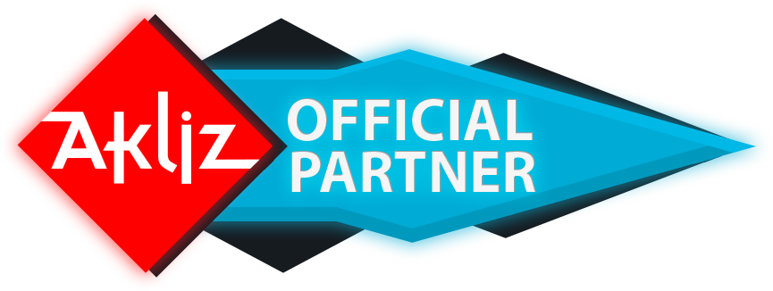

# Zerblands-Remastered

  

*An old Classic remade in a newer Version* • [CurseForge](https://www.curseforge.com/minecraft/modpacks/zerblands-remastered) • [Changelog](CHANGELOG.md) • [Bugtracker](https://github.com/MasterEnderman/Zerblands-Remastered/issues)

&nbsp;

## Introduction

Zerblands is a Modpack containing some well known mods, but most of the recipes got edited so that there is a new progression line the player has to follow to play through this modpack.

This Modpack also contains a questbook, which guides the player through the different stages of the pack. Furthermore there is patchouli guide, that shows the player useful information, like ore generation values and useful tips on how to play through the modpack.

## Roadmap

With **version 2.1.8** the second packmode (called `Nightmare Mode`) can be accessed from within the pack. After changing the packmode you need to restart the pack. The new packmode comes with it's own questbook and new challenges to overcome. I'm still working on further improving the packmode as well as fixing most of the bugs while they come up.

With **version 2.2.x** the `Nightmare Mode` is basically finished besides balancing some recipes as well fixing a few loop holes I created while developing the packmode.

With **version 2.2.7** the available block IDs will be completely used up and I can't free up any of them without breaking compatibility with older worlds. I still plan to optimize and document as much of the modpack as possible before starting to work on version 2.3.x and beyond.

With **version 2.3.0** the `Nightmare Mode` will become the default mode as the now called `Legacy Mode` won't get any further updates (besides bug fixes). I'm still working on fixing the balance for some parts of the end game as I slowly approach it in my own playthrough. If you have any feedback feel free to open an issue on github. :) Furthermore version 2.3.0 will break any worlds created in an older version, so I recommend finishing your playthrough, before updating to version 2.3.0 otherwise you will lose all of your progress as I will clean up a lot of block ids, which breaks compatibility with older worlds. Another feature of version 2.3.0 will be an extended midgame, with more mods integrated into the overall progression. Stay tuned for further updates!

## Pack-Developer

`_MasterEnderman_` - Project-Manager, Lead-Artist, Developer

[♥ Socials](https://ender.bio.link)

## Partnership with Akliz

> It's a pleasure to be partnered with Akliz. Besides being a fantastic server provider, which makes it incredibly easy to setup a server of your choice, they help me to push myself and the quality of my projects to the next level. Furthermore you can click on the banner below to get a discount. :')

If you aren't located in the [US](https://www.akliz.net/enderman), Akliz now offers servers in:

- [Europe](https://www.akliz.net/enderman-eu)
- [Oceania](https://www.akliz.net/enderman-oce)

## Special Thanks

`Zerberus1979` - a close friend of mine, who motivated me to start with the Zerblands modpack in the first place

- [Underworld - Discord](https://discord.gg/tZgppPC2pa)

`Rongmario` and the people behind `CleanroomMC` - for keeping modded 1.12 alive and still offer improvements for it

- [Cleanroom - Discord](https://discord.gg/f2K4aSpG4F)

`Desoroxxx` and her `Opticraft` [project](https://red-studio-ragnarok.github.io/Opticraft/) - for her complete guide for an optimized 1.12 modded experience

- [Red Studio - Discord](https://discord.gg/hKpUYx7VwS)
