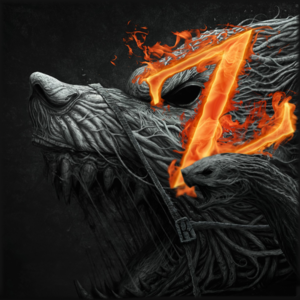

# Zerblands-Remastered

  

*An old Classic remade in a newer Version* • [CurseForge](https://www.curseforge.com/minecraft/modpacks/zerblands-remastered) • [Changelog](config/mputils/changelog.txt) • [Bugtracker](https://github.com/MasterEnderman/Zerblands-Remastered/issues)

&nbsp;

## Introduction

Zerblands is a Modpack containing some well known mods, but most of the recipes got edited so that there is a new progression line the player has to follow to play through this modpack.

This Modpack also contains a questbook, which guides the player through the different stages of the pack. Furthermore there is an ingame guide, that shows the player usefull information, like ore generation values and usefull tips on how to play through the modpack

## Pack-Developer

`_MasterEnderman_` - Project-Manager, Lead-Artist, Developer

- BuyMeACoffee: <https://www.buymeacoffee.com/masterenderman>
- Curseforge: <https://www.curseforge.com/members/endermanwhosearchthebeast/projects>
- Discord: <https://discord.gg/JF7x2vG>
- GitHub: <https://github.com/masterenderman>
- Patreon: <https://www.patreon.com/_masterenderman_>
- Twitch: <https://www.twitch.tv/endermanwhosearchthebeast>
- Twitter: <https://twitter.com/_bitfabrik_>
- Youtube: <https://www.youtube.com/user/xxmasterendermanxx>
