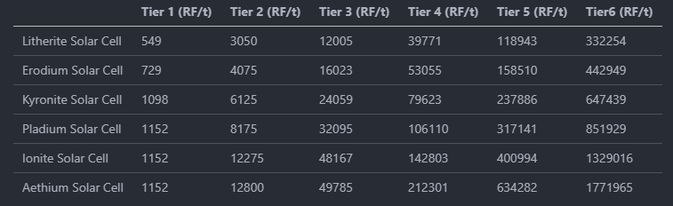

# Environmental Tech

## Lightning Rod

- 375000 RF / Lightning Strike [Default: 750000]

## Solar Array

- Litherite Solar Cell Production = 24 RF / Cell [Default: 48]
- Erodium Solar Cell Production = 32 RF / Cell [Default: 64]
- Kyronite Solar Cell Production = 48 RF / Cell [Default: 96]
- Pladium Solar Cell Production = 64 RF / Cell [Default: 128]
- Ionite Solar Cell Production = 96 RF / Cell [Default: 192]
- Aethium Solar Cell Production = 128 RF / Cell [Default: 256]

## Ore Miner

- Tier 1 Ore Miner = 2000000 RF / Block [Default: 264000]
- Tier 2 Ore Miner = 1800000 RF / Block [Default: 184000]
- Tier 3 Ore Miner = 1400000 RF / Block [Default: 120000]
- Tier 4 Ore Miner = 1000000 RF / Block [Default: 72000]
- Tier 5 Ore Miner = 800000 RF / Block [Default: 40000]
- Tier 6 Ore Miner = 600000 RF / Block [Default: 16000]

## Resource Miner

- Tier 1 Resource Miner = 80000 RF / Block [Default: 64000]
- Tier 2 Resource Miner = 60000 RF / Block [Default: 32000]
- Tier 3 Resource Miner = 40000 RF / Block [Default: 16000]
- Tier 4 Resource Miner = 20000 RF / Block [Default: 8000]
- Tier 5 Resource Miner = 10000 RF / Block [Default: 4000]
- Tier 6 Resource Miner = 5000 RF / Block [Default: 2000]

## Botanic Miner

- **Disabled**

## Nanobot Beacon

- Absorption Potion Effect = 640 RF / tick [Default: 64]
- Creative_flight = 640 RF / tick [Default: 64]
- Fire_resistance Potion Effect = 640 RF / tick [Default: 64]
- Flight Speed = 640 RF / tick [Default: 64]
- Glowing Potion Effect = 640 RF / tick [Default: 64]
- Haste Potion Effect = 640 RF / tick [Default: 64]
- Health Boost Potion Effect = 640 RF / tick [Default: 64]
- Invisibility Potion Effect = 640 RF / tick [Default: 64]
- Jump Boost Potion Effect = 640 RF / tick [Default: 64]
- Night Vision Potion Effect = 640 RF / tick [Default: 64]
- Regeneration Potion Effect = 640 RF / tick [Default: 64]
- Resistance Potion Effect = 640 RF / tick [Default: 64]
- Saturation Potion Effect = 640 RF / tick [Default: 64]
- Strength Potion Effect = 640 RF / tick [Default: 64]
- Water Breathing Potion Effect = 640 RF / tick [Default: 64]
