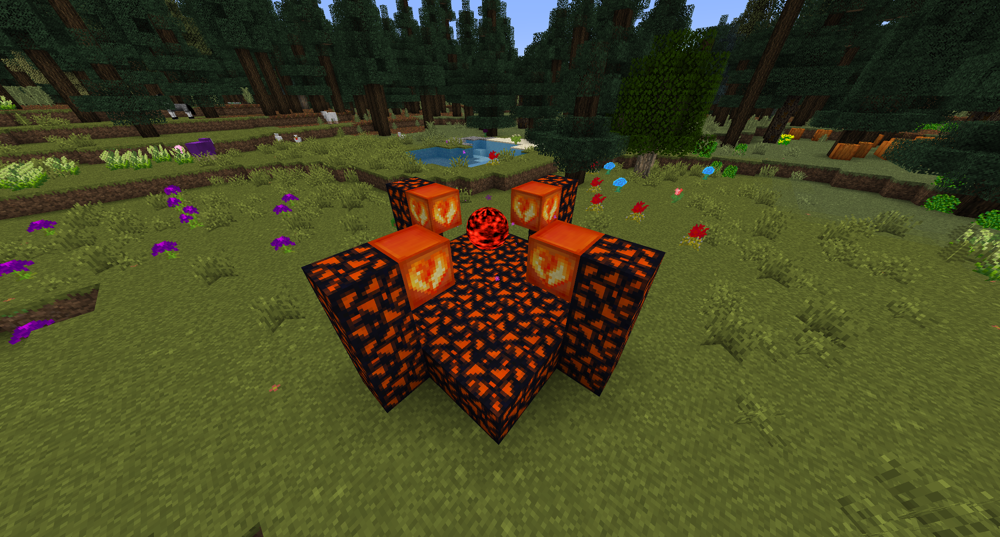

# Documentation

## Bloodmagic

Varoius aspects of Bloodmagic can be automated using a **Woot Mobfarm**. You can fill your altar by building a **Woot Mobfarm** with the corresponding ritual above or below your altar.
The best mob to use for **Bloodmagic - Woot Combination** are **Villagers**. As they have a higher mass spawn count then all other mobs. That way they provide much more blood for all your needs.

## Draconic Additions

### Chaos Stabilizer

To make your chaotic tool and armor useable they have to be stabilized first. This is done in the **Chaos Stabilizer**.
The Awakened Draconium Blocks are consumed in the stabilization process. (Keep a healthy distance to the core while the machine is running.)
You start the process by throwing your item towards the **Chaos Stabilizer Core**.

## EnderIO

Currently the Experience Obelisk doesn't work on servers.
The issue is already known since december 2020.
[-> Github](https://github.com/SleepyTrousers/EnderIO/issues/5487)

## Not Enough Wands

Currently the Potion Wand doesn't work.
This issue is already known since december 2018.
[-> Github](https://github.com/romelo333/notenoughwands/issues/83)

## Tinkers' Construct

Tutorial on how to make crossbow bolts.
[-> Wiki](https://tinkers-construct.fandom.com/wiki/Bolt)

## Woot

Woot is able to generate **BloodMagic Life Essence** or **Evilcraft Blood**. Use some Woot Mob Farms to improve the performance of your world.
Furthermore you're able to improve **Demon Will Crystal Growth**.
