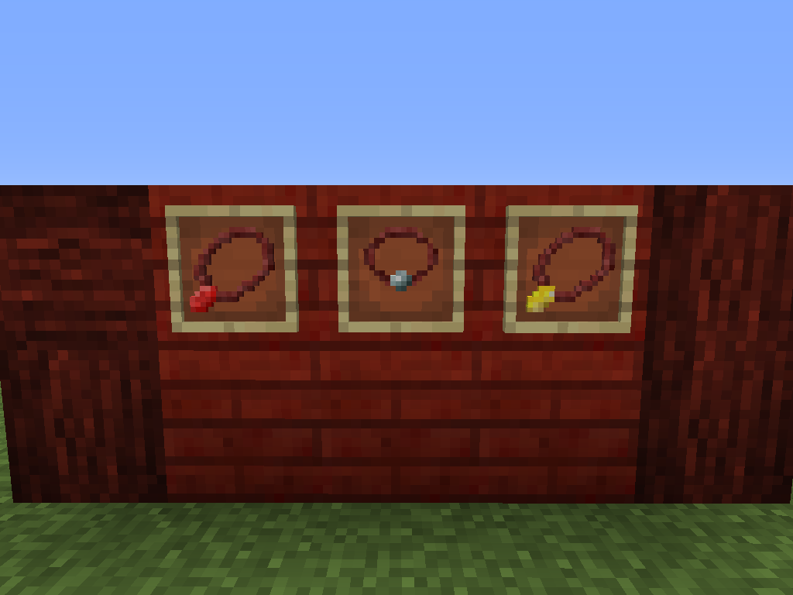
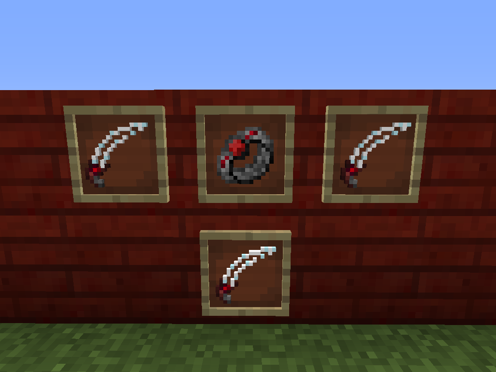

# Baubles

Here's a quick rundown of the numerous baubles within Blood Arsenal so far:

**Amulet of Self/Sacrifice**: When worn, these will passively collect LP from the respective occurrences of their names (for example the Amulet of Self Sacrifice will collect LP when you take damage). Both have a capacity of 10,000 LP and can be shift-right clicked on the Blood Altar to dump their contents.

**Soul Pendants**: This piece of jewelry functions exactly like a Tartaric Gem, but can be worn in the Amulet slot. Like Tartaric Gems, they can inherit a certain Demon Will type (corrosive, destructive, vengeful, steadfast) and can be used in the Tartaric Forge.

**Ring of Vampirism**: This ring will allow the player to feast on the Life Essence of nearby creatures that are bleeding. Any living entities within a 5 block vicinity that have the Bleeding status effect will return a portion of their lost health to the player.

