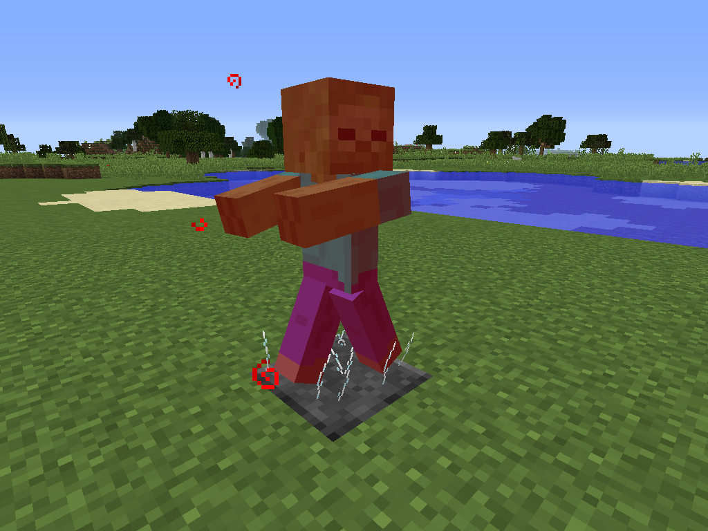
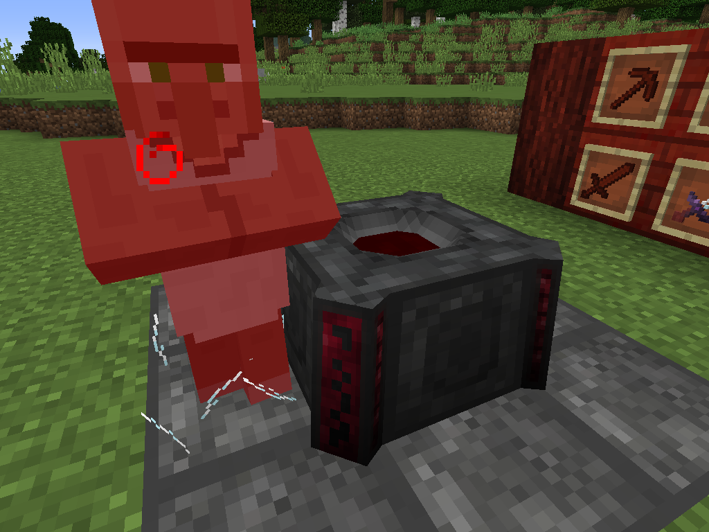
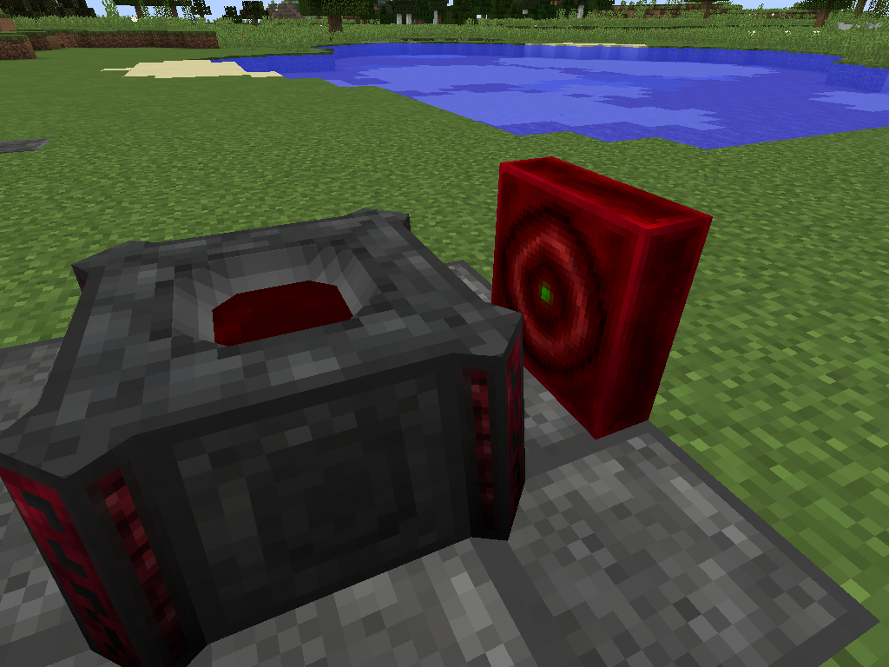
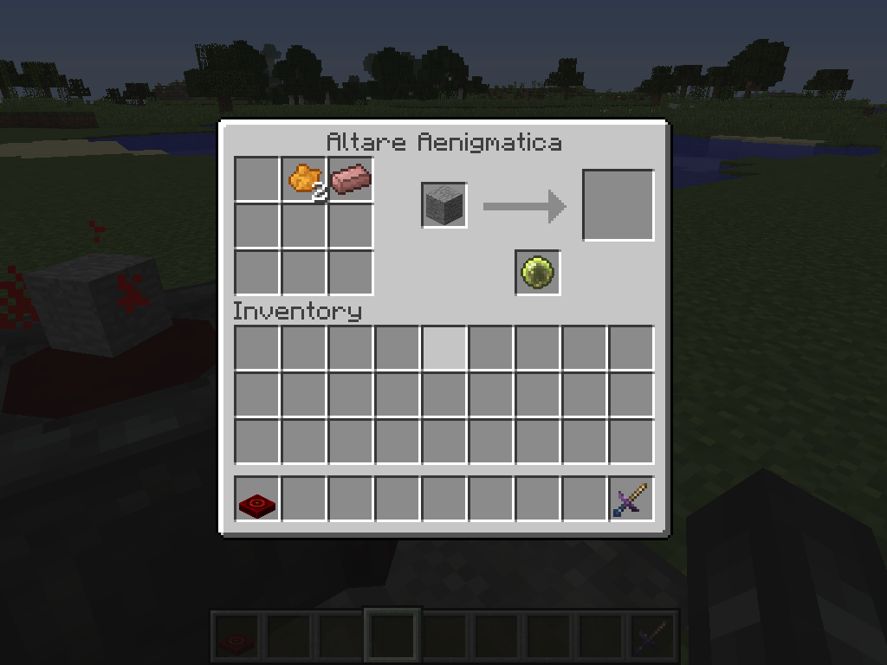

# Machines

## Spikes

Glass can be quite dangerous. Thankfully, you can utilize that to your advantage, so long as you're careful! Glass Shards can be combined to create a block version that is useful for traps, automated LP collection, and just in general, any place where you need some spikes!

These spikes will inflict bleeding and damage any living entity that happens to stroll onto it. Even more useful is the fact that it can go on all six sides of a block! And any bleeding entity will fill up a nearby Blood Altar. Combine these two properties and you can probably create an early-game LP collection system besides the Altar. Do note however, that entities killed by the spikes or bleeding will drop considerably less mob drops then they would otherwise, so these spikes might not be the best option for a mob drops farm.

## Altare Aenigmatica

Introducing the Altare Aenigmatica! For all your Altar automating needs! This really useful block has a pretty complicated GUI when opened up, so listen carefully! First off, you can place it in any of the 6 directions facing the Blood Altar like so:

Opening the GUI will yield a pretty complicated arrangement of slots. First and foremost, an Orb that is bound to the player must be right-clicked on the block itself to be bound to the player. Next, put the Orb into the Orb slot of the Altare Aenigmatica. Now, any item you want to have crafted inside of the Blood Altar will go into the 9 slots on the left. The current items within the Altar will be displayed within the Altare Aenigmatica's GUI.

This block is rather complicated. To start, it assumes two things: The Blood Altar has a consistent input of LP from some source, and that you have some method of pulling out items from the Blood Altar after they are done crafting. These two requirements can be accomplished within Blood Magic itself or with other mods.

The Altare Aenigmatica will by default (with no items in the input buffer) place the linked Orb into the Altar. If any item that can be crafted within the Blood Altar is put inside of the Altare Aenigmatica, it will automatically pull out the Orb, and wait until the Blood Altar has enough LP to craft the itemstack of whatever is in its input buffer. Once the Blood Altar has enough LP, the Altare Aenigmatica will then proceed to put the entire itemstack into the Altar for it to craft. Pretty darn useful eh?
