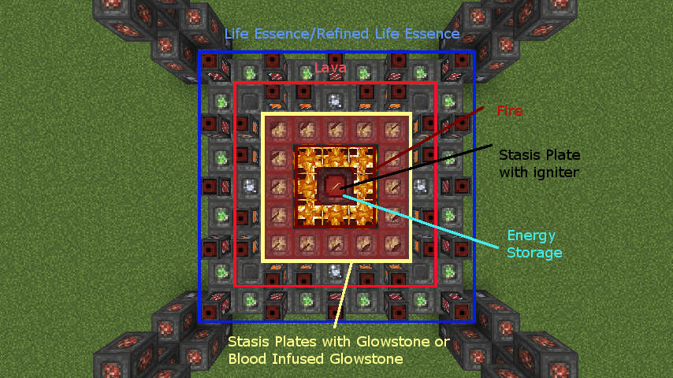

# Rituals

There's a few nifty rituals in Blood Arsenal that do a handful of things!

## Infusion de Sanguine

This ritual is akin to an advanced infusion ritual, and takes multiple inputs and infuses it into the central input. The ritual itself is very large, so plan accordingly. Stasis Plates are required to activate and use this ritual, and they should be placed as shown.

The ritual is used to create Stasis Tools which are extremely powerful and adaptive tools that can be modified with a series of different modifiers in the ritual.

## Ritual of Purification

This ritual helps purify mundane Life Essence down into Refined Life Essence, a liquid that is much more potent than Life Essence. This ritual requires Stasis Plates, and purifies Life Essence into Refined Life essence in a 10 : 1 ratio. Redstone, Blaze Powder, Ender Pearls, and Blood Infused Glowstone Dust are also required.

The top tank must contain Life Essence, while the bottom must either be empty or contain Refined Life Essence. Note: the ritual will continue to purify liquids as long as the correct inputs are present.

## Blood Burner Rites

This is an extremely powerful ritual with seemingly limitless potential. It takes in liquid Life Essence (Normal or Refined) and combines it with Glowstone and Lava to create energy.

The layout is quite complicated, and here is a top-down view for reference:

The spaces where Blood Tanks and Stasis Plates are do not all have to be filled. However, they are the only places where the ritual will seek and consume the necessary ingredients. A central stasis plate with an Igniter of some sort must be present. The Fire next to the Master Ritual Stone is required! An energy storage block of any kind must also be present above the igniter. A Blood Capacitor is a simple energy storage block that can hold up to 10 million units of energy.

The Blood Burner Rites will consume one unit of every ingredient provided. That means that for each Blood Tank present, it will only consume 1 bucket of the liquid inside (less if it is Refined Life Essence), and no more! Even if you have a tank with more than 1 buckets worth of fluid, it will only consume a bucket per cycle. The same goes for the glowstone. The Blood Burner Rites will also continue cycling as long as the proper inputs are present.

The igniter can either be Flint and Steel or a Bound Igniter which affects how well the ritual burns.
You can either use Glowstone Dust or Blood Infused Glowstone Dust for the item ingredients which also affects how much energy is produced.
More Lava = faster burn time.
Refined Life Essence lasts 4x longer than Life Essence and produces more energy as well. More life essence in general means more energy produced in total.
