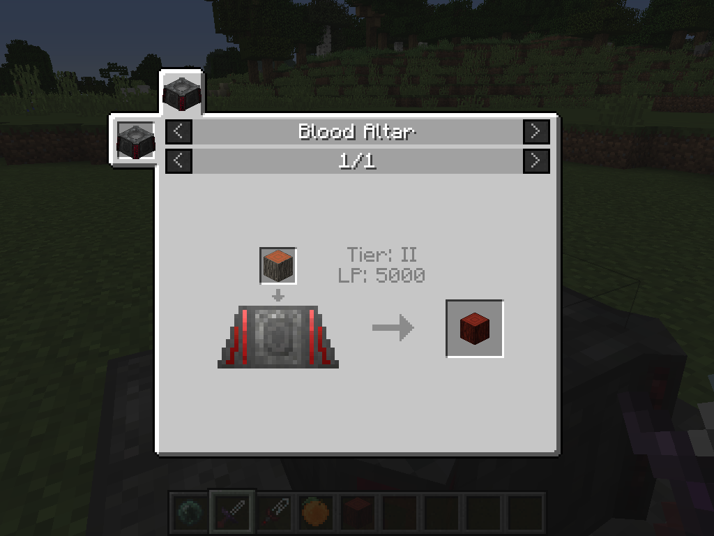
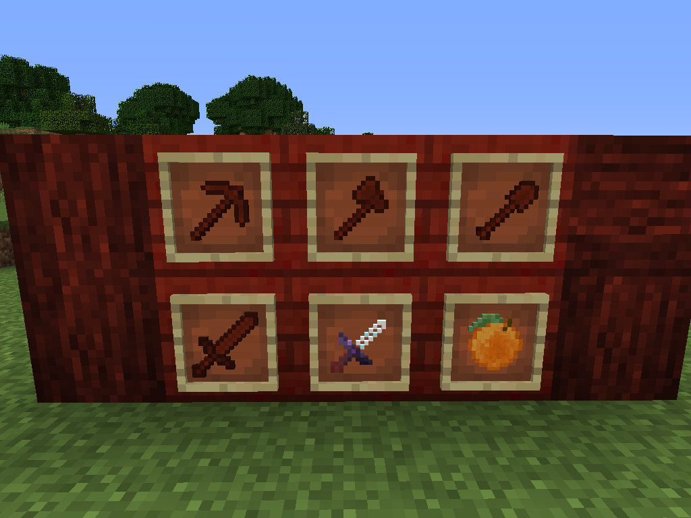
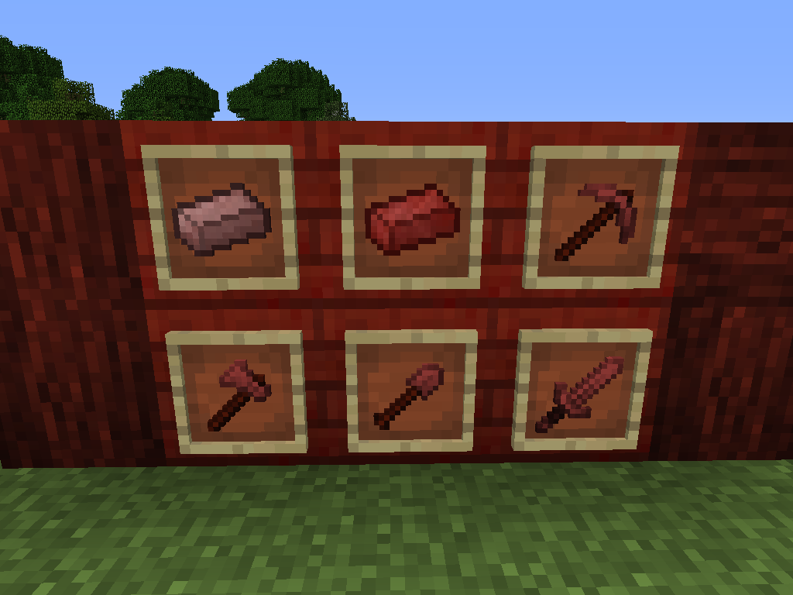
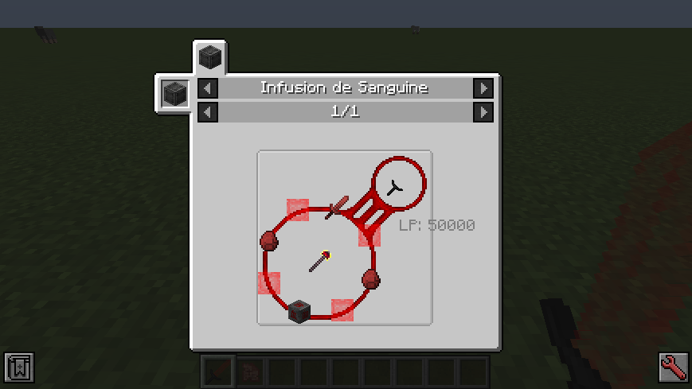
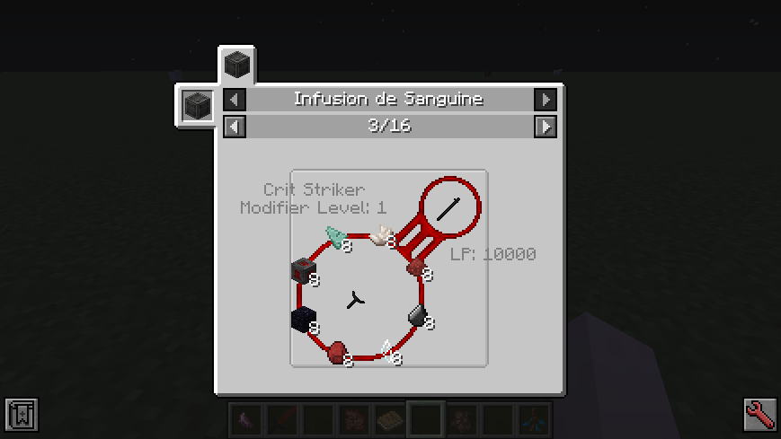
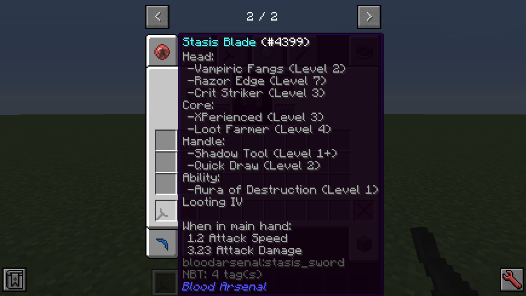

# Tools

## Blood Infused Wooden Tools

Blood Arsenal adds in plenty of tools, such as the starting Blood Infused Wooden Tools. To get them, simply place a Log (any log will do) into a Tier II Blood Altar with 5000 LP to get a Blood Infused Log.

Blood Infused Wooden Tools are quite handy and useful for early game players who don't want to keep replacing their broken tools. The material (Blood Infused Wood) that they are made up of is living and regenerative, and the tools themselves will "grow back" and repair themselves using the holder's Soul Network and a small LP cost. The tools themselves are overall better than stone and up to par with iron.

## Blood Infused Iron Tools

If you're ready to progress down the line of Blood Magic and Blood Arsenal, set your sights on Blood Infused Iron! This material is quite a step up from Blood Infused Wood, and the tools are much stronger, and regenerate much faster than the previous tier. Do note however that the costs of regeneration are higher than the previous tier.

## Stasis Tools

Stasis Tools are incredibly powerful tools with extremely high potential that can be upgraded like Living Armor. Crafting is done through the Infusion de Sanguine ritual (in the Ritual spoiler), and certain modifiers can be added onto the tools.

Modifier recipes can be viewed in JEI, by looking at the usages of a Master Ritual Stone or a Stasis Tool and going to the Infusion de Sanguine tab. Upgrades can then be applied to the tools (default Level I), and the more you use the tool and the upgrade, the more experience the modifier gets. When you get enough experience with the modifier, you will see a + icon on the tooltip next to the modifier indicating that it's ready to be upgraded to the next level. Place it into the Infusion de Sanguine ritual with the appropriate items and amounts and it will then be upgraded to the next level!

If you want to remove Modifiers from your Stasis Tool, throw the tool into the Sound of the Cleansing Soul and Modifier Tomes with their respective modifiers will pop out. To add Modifier Tomes back to a Stasis Tool, put the Stasis Tool into your offhand and right-click the Modifier Tome with your main hand.

## Modifiers for Stasis Tools

Different Modifiers go on different parts of the tool. The Head can only take 3 modifiers, the Core and Handle can take 2 each, and the Ability can take 1 modifier. Modifiers can get extremely powerful with higher levels!

### Head Modifiers

Potion (Debuff): Has a chance to put the negative potion effect on enemies
Bloodlust: Increases your tool's attack each time you attack something. The effect slowly fades if it is not being used.
Crit Striker: Has a chance to crit when attacking something for extra damage
Ember's Touch: Sets things on fire
Razor's Edge: Increases the base attack of your tool - Incompatible with Bloodlust
Vampiric Fangs: Gives you life steal when you attack

### Core Modifiers

Luck's Charm: Puts Fortune on your tool
Loot Farmer: Puts Looting on your tool
Silky Silk: Puts Silk Touch on your tool
Shmelty Smelt: Cooks items that are harvested - Level 2 cooks blocks and items
XP-erienced: Gives you XP whenever you use the tool

### Handle Modifiers

Potion (Buff): Has a chance to apply a beneficial potion to you when you use the tool
Quick Draw: Increases the speed at which you can use your tool from the hotbar
Shadow Tool: Allows you to use a mundane version of your tool when it is deactivated

### Ability Modifiers

Aura of Destruction: Adds the ability to destroy things in a radius around you by holding and releasing right-click - tool abilities apply to destroyed blocks/entities
Sigil: Attaches an activatable sigil that can be toggled onto your tool
