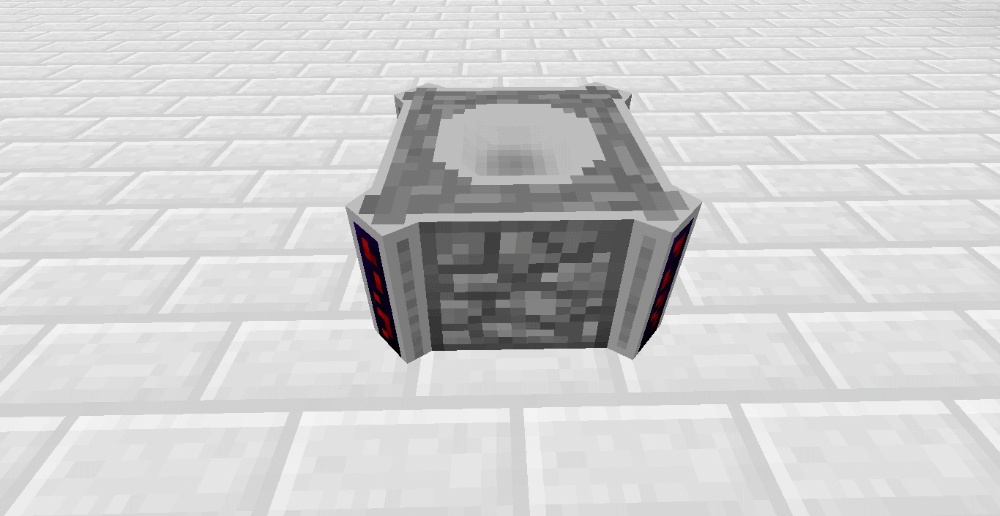
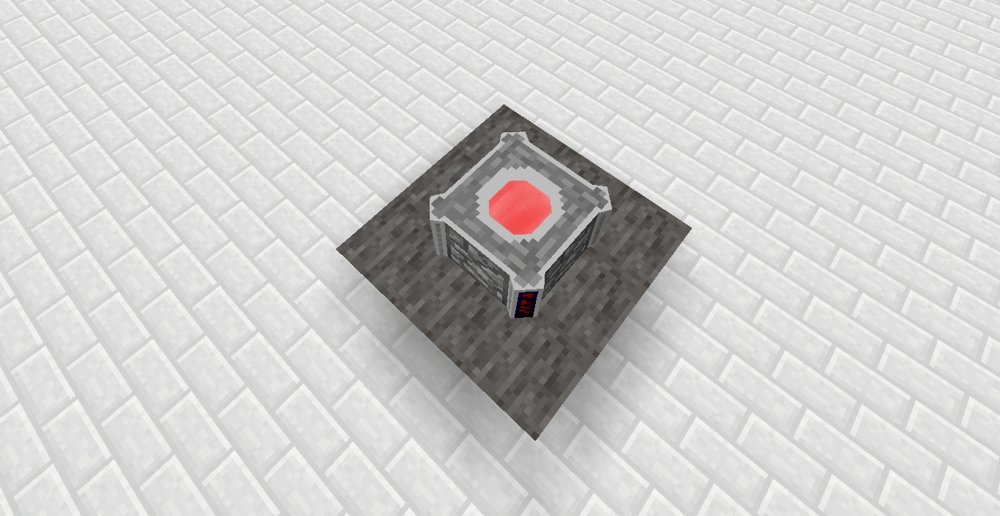
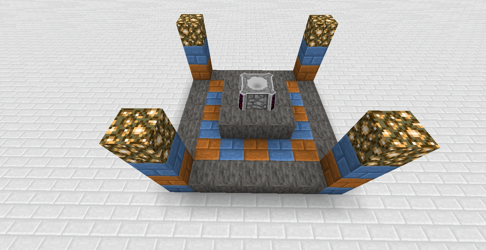
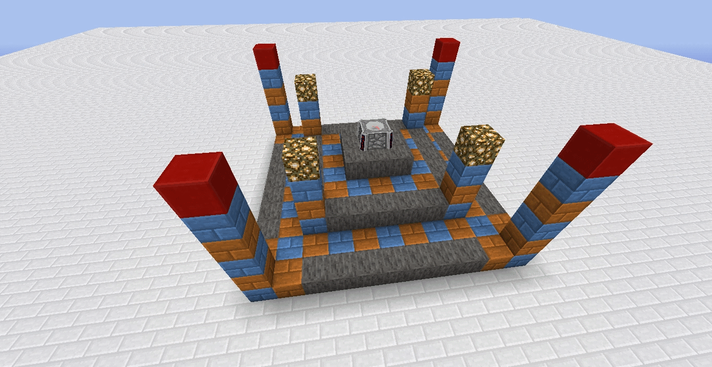
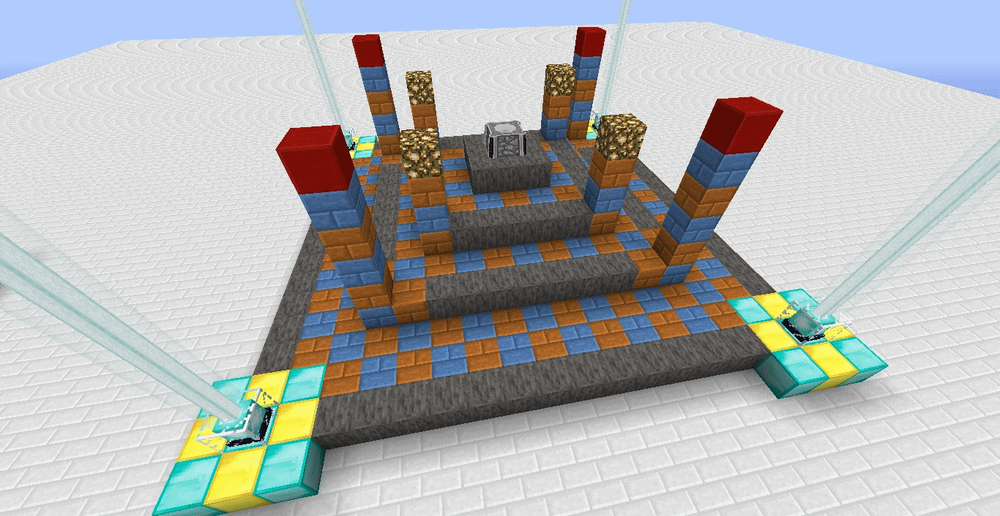
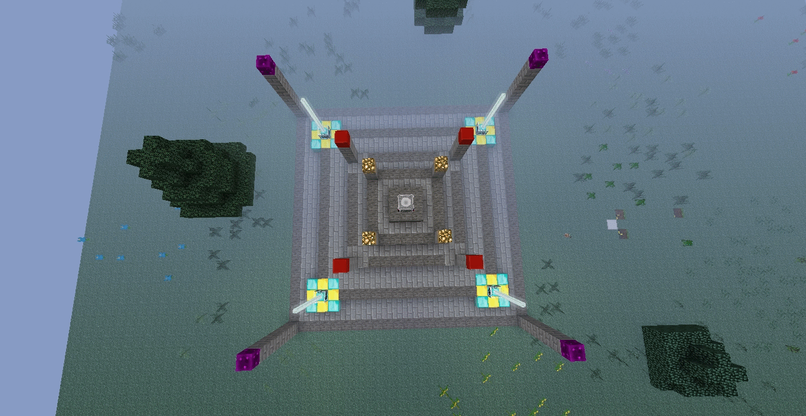

# Blood Altar Construction

## Tier I

Additional Blood Runes: 0
Total Blood Runes: 0
Maximum LP Storage: 10,000
Dimensions: 1x1x1

## Tier II

Additional Blood Runes: 8
Total Blood Runes: 8
Maximum LP Storage: 10,000
Dimensions: 3x3x2

## Tier III

Additional Blood Runes: 20
Total Blood Runes: 28
Additional Structure(s): 4x two-block pillars capped with Glowstone
Maximum LP Storage: 66,000
Dimensions: 7x7x4

## Tier IV

Additional Blood Runes: 28
Total Blood Runes: 56
Additional Structure(s): 4x four-block pillars capped with Large Bloodstone Brick
Maximum LP Storage: 122,000
Dimensions: 11x11x6

## Tier V

Additional Blood Runes: 52
Total Blood Runes: 108
Additional Structure(s): 4 Beacons
Maximum LP Storage: 226,000
Dimensions: 19x19x7

## Tier VI

Additional Blood Runes: 76
Total Blood Runes: 184
Additional Structure(s): 4x seven-block pillars capped with Crystal Cluster
Maximum LP Storage: 378,000
Dimensions: 23x23x9

[-> Wiki](https://ftb.fandom.com/wiki/Blood_Altar)
