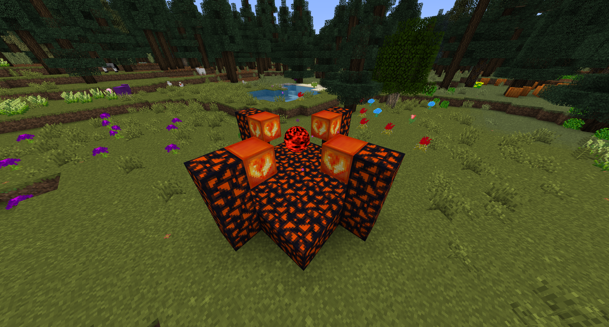

# Draconic Additions

## Chaos Stabilizer

To make your chaotic tool and armor useable they have to be stabilized first. This is done in the **Chaos Stabilizer**.
The Awakened Draconium Blocks are consumed in the stabilization process. (Keep a healthy distance to the core while the machine is running.)
You start the process by throwing your item towards the **Chaos Stabilizer Core**.

