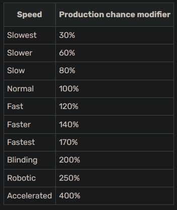
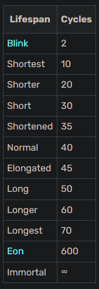
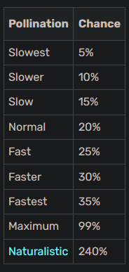

# Forestry

## Bee Breeding Stats

### Speed

### Lifespan

### Fertility

Fertility controls how many drones are spawned when the queen dies.
Possible offspring sizes:

- 1 Drone
- 2 Drones
- 3 Drones
- 4 Drones

### Pollination

### Territory

Territory is a mechanic utilized by bees. It is the area size in which bees search for their flower and use their innate effects. The rate of flower spreading in this area is increased. Alvearies boost the territory by a factor of 2, so the standard size of 9x6x9 changes to 18x12x18, centered on the Apiary/Alveary. The most common size is 9x6x9 (XxYxZ).

### Flowers

- Flowers (Vanilla) - Can pollinate trees.
- Mushroom - Can pollinate trees.
- End (Chorus) - Can pollinate trees.
- Jungle (Vines) - Can pollinate trees.
- Wheat - Can pollinate trees.
- Cacti - Can pollinate Acacia.
- Nether (Netherwarts) - Cannot pollinate trees.

### Effect

Several bees have special effects, which can be activated inside their territory (usually 9x6x9).

### Cave Dwelling

Cave dwelling queens don't need to see the sky from their apiary.

### Nocturnal

Nocturnal queens work both day and night.

### Rain Tolerant

Rain tolerant bees will produce in spite of rain.

### Temperature

Queens have different requirements concerning the temperature rating of their biome. This attribute is locked with the species and cannot be changed. If the temperature of the current biome isn't matching their tolerance, the bee won't produce, but it also won't age.
The following temperatures exist:

- Icy
- Cold
- Normal
- Warm
- Hot
- Hellish

### Temperature Tolerance

Queens have different tolerances concerning the temperature rating of their biome. If the temperature of the current biome isn't matching their tolerance, the bee won't produce, but it also won't age.
The following tolerances currently exist:

- None
- Both 1
- Both 2
- Both 3
- Down 2
- Down 3
- Up 1
- Up 2

### Humidity

Queens have different requirements concerning the humidity rating of their biome. This attribute is locked with the species and cannot be changed. If the humidity of the current biome isn't matching their tolerance, the bee won't produce, but it also won't age.
The following humidities exist:

- Arid
- Normal
- Damp

### Humidity Tolerance

Queens have different tolerances concerning the humidity rating of their biome. If the humidity of the current biome isn't matching their tolerance, the bee won't produce, but it also won't age.
The following tolerances exist:

- None
- Both 1
- Both 2
- Down 1
- Down 2
- Up 1
- Up 2
