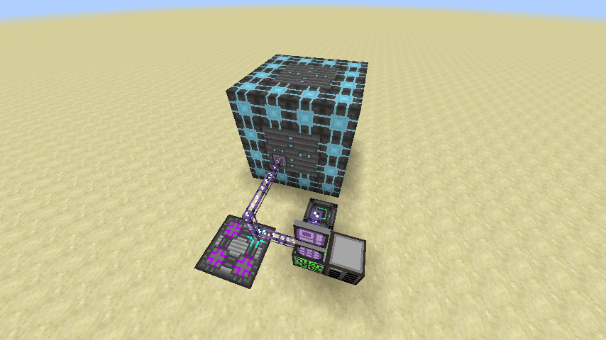
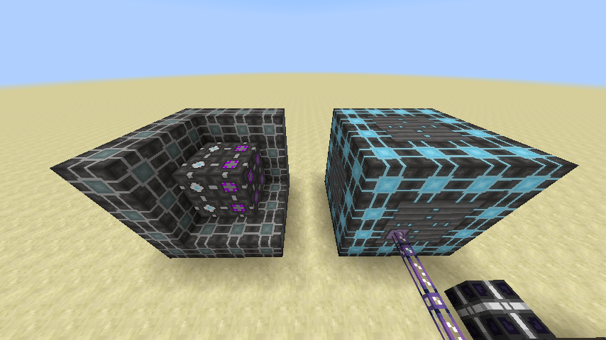
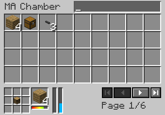

# Mass Assembly Chamber

The Mass Assembly Chamber is a multi-block apparatus that provides autocrafting for crafting table recipes. It's intended to be an easier means of scaling up autocrafting than traditional molecular assemblers, which consume many channels and require intricate structures to maximize efficiency.

## Assembly

The MA Chamber is structured similarly to the classic AE1 molecular assembler. It should be a cuboid with:

Edges composed of MA Frame.
Walls composed of MA Vent, MA Controller, and MA IO Port.
Exactly one MA Controller in one of the walls.
Interior composed of MA Crafting Coprocessors, MA Pattern Providers, and air.
At least one MA Pattern Provider.
At most 512 blocks of internal volume (i.e. not including the walls).
To finish assembly, right-click the MA Controller. If all is successful, the structure will form and light up blue. The assembler can then be connected to your ME network from the controller.

Note that if you wish to add more pattern providers or coprocessors, you will have to disassemble and reassemble the MA Chamber. This can be done by simply removing any block in the structure, replacing it, then right-clicking the controller again.

## Function

The MA Chamber can be right-clicked anywhere to bring up its GUI. From here, you can access the inventories of the pattern providers, which each store 36 crafting patterns. Each page of slots in the GUI represents one pattern provider; these can be navigated using the navigation buttons in the GUI or by scrolling with the mouse wheel. If the MA Chamber is disassembled, the pattern providers will retain their pattern inventories, but you will not be able to access the patterns without either dismantling the providers or re-assembling the multiblock.

When a crafting task is requested, the MA Chamber will add the task to its internal queue of pending tasks. If the internal queue is filled, the MA Chamber will be unable to accept new tasks until one of the queued tasks has been completed and removed from the queue. The queue size is configurable; by default, it can hold up to 64 pending tasks. However, there is no method of increasing the queue size in-game.

The MA Chamber tracks a numeric value called "work", which represents the progress on the current pending crafting tasks. Each tick, the MA Chamber will attempt to do work (i.e. increase the work value). The amount of work done per tick is configurable, and defaults to 1. This work rate can be increased by installing MA Crafting Coprocessors: each installed coprocessor adds an additional bonus to the work done per tick, which defaults to 3. Note that each installed coprocessor will also increase the amount of energy consumed per work done!

Once enough work has been done, the MA Chamber will dispatch a pending crafting task; by default, each task requires 16 completed work. When a task is dispatched, it will be removed from the internal queue, consume ingredients from the internal ingredient inventory, then place the crafting result into the ME storage network. If enough work is done in one tick to complete multiple crafting tasks, then as many tasks as possible will be dispatched simultaneously. This means that with enough coprocessors, it's possible to dispatch the entire crafting queue in a single tick.

## Other Notes

A pattern provider's page does not need to be selected to access it in the GUI; shift-clicking crafting patterns into the Mass Assembly Chamber GUI will insert them into the first empty space in any pattern provider.
The order and arrangement of the patterns in the pattern providers does not affect the crafting logic in any way.
Because the interface terminal is designed to work with only ME interfaces, the MA Chamber's pattern inventory cannot be accessed from an interface terminal.
The MA IO Port lets you access the MA Chamber's pattern inventory mechanically. You could, for example, place a storage bus facing an IO port to simulate an interface terminal.

[-> Wiki](https://github.com/phantamanta44/Lazy-AE2/wiki/Mass-Assembly-Chamber)
