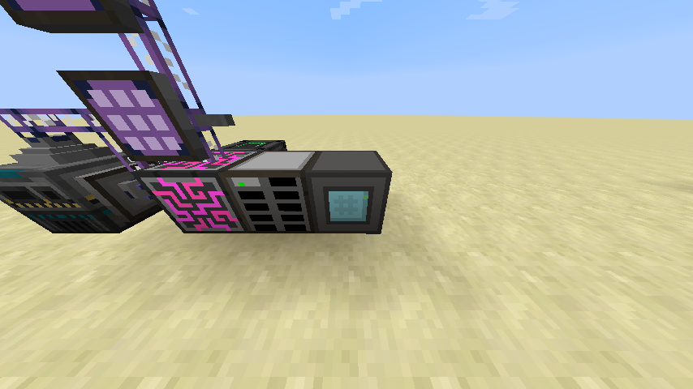
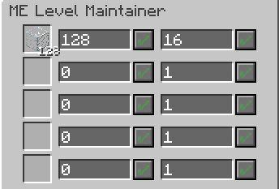

# ME Level Maintainer

The ME Level Maintainer is used to maintain some quantity of an item in the ME network. This is accomplished by requesting autocrafting for items that fall beneath a certain quantity threshold.

To use the ME Level Maintainer, items should be loaded into the left slots to request that they be maintained. Note that these are ghost slots, so items placed in them are not consumed.

Two quantities can be configured for each entry in the ME Level Maintainer. The left quantity corresponds to the quantity threshold; this is the minimum quantity of the item that should be maintained in the network. The right quantity corresponds to the crafting batch size; this is the amount of the item that should be requested in a crafting operation. Note that the crafting batch size is analogous to the amount requested in the autocrafting request GUI. If the configured batch size is less than the output count for the pattern that handles the crafting, then the ME network will request the pattern's output count, thus over-shooting the configured batch size.

As an example, suppose you have your ME Level Maintainer configured to maintain 256 glass with a batch size of 32, and your ME network is equipped with a pattern that takes 64 sand and smelts it into 64 glass. If you remove 10 glass from your network, you're left with 246 glass, which the level maintainer will detect. The level maintainer will then request autocrafting for 32 glass, which is handled by the glass-smelting pattern. The autocrafting system then rounds up to 64 glass and executes the crafting, leaving you with 246 + 64 = 310 glass in the end.

[-> Wiki](https://github.com/phantamanta44/Lazy-AE2/wiki/ME-Level-Maintainer)
