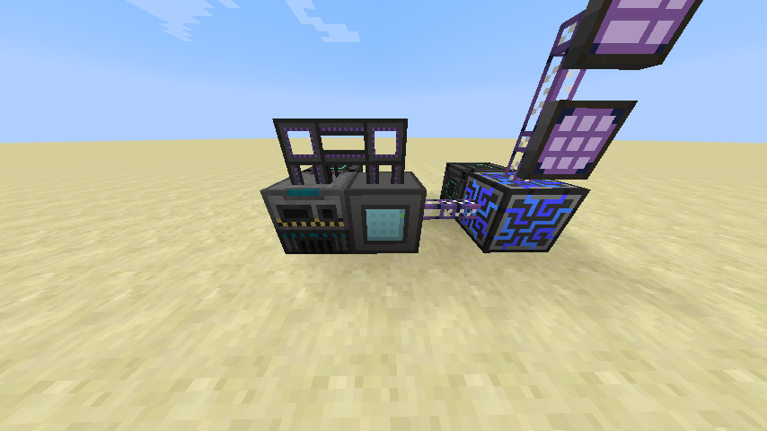
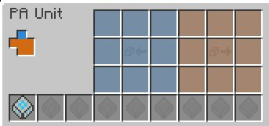

# Preemptive Assembly Unit

The Preemptive Assembly Unit is an autocrafting device that functions similarly to an ME interface. When supplied with patterns, it will be able to dispatch processing recipes to adjacent machines. However, unlike the ME interface, the PA Unit is "greedy"; upon receiving a crafting job, it will query the CPU responsible for the job and attempt to take as much of the remaining operations as possible.

As an example, suppose a simple sand-to-glass smelting recipe is implemented in an ME network. If someone requests autocrafting for 64 glass, a standard ME interface will dispatch one sand at a time to the processing device, whereas the PA Unit will immediately dispatch all 64 sand in a single operation. This eliminates the bottleneck of needing a large number of crafting coprocessors to efficiently utilize all the resources available to an autocrafting system.

To use a PA Unit, encoded patterns are loaded into the bottom row of slots, which are then exposed to the autocrafting system on the network. The blue slots function as an input buffer for the system; items placed in those slots are inserted into the ME network. The orange slots function as an output buffer; items placed in those slots will be pushed to adjacent machines. Side configuration is managed with the buttons on the left. Input sides correspond to the input buffer whereas output sides correspond to the output buffer.

There are some drawbacks to the PA Unit as opposed to a standard ME interface. In particular:

The ME interface supports more advanced configuration options and behaviour.
The PA Unit cannot be accessed from an interface terminal.
The PA Unit cannot be used to drive molecular assemblers.
The PA Unit only comes in the full-block form.
The PA Unit is significantly more expensive than the ME interface.
As such, it is recommended that ME interfaces be used for general purpose autocrafting, whereas the PA Unit should be reserved for the rare cases where high throughput is absolutely necessary.

[-> Wiki](https://github.com/phantamanta44/Lazy-AE2/wiki/Preemptive-Assembly-Unit)
