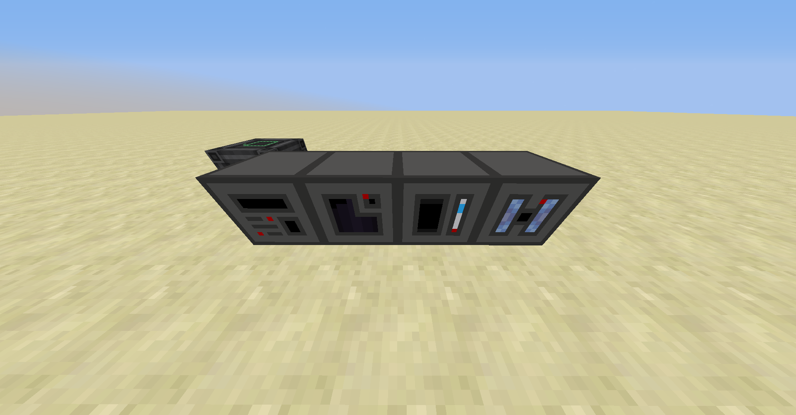
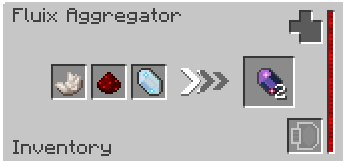
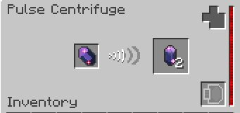
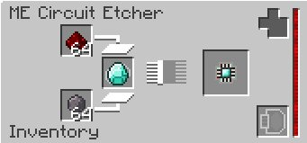
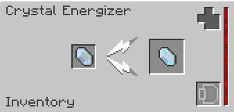

# Processing Machines

Lazy AE2 adds four new processing machines that streamline AE2's default processing workflows. These machines are powered using Forge Energy and don't require an ME network to run. They have configurable sides, although they do not automatically push outputs to adjacent inventories; you'll have to pull them out using item pipes. They're somewhat slow by default, but can be sped up with the installation of acceleration cards at the cost of additional energy consumption.

Additionally, Lazy AE2 offers JEI integration for showing processing machine recipes. This is the recommended way to play with Lazy AE2.

## Fluix Aggregator

The Fluix Aggregator performs the operation of fluix crystal production, which is normally an inconvenient in-world operation. It is also used to craft other Lazy AE2 crafting components -- in particular, it significantly increases the efficiency of producing fluix steel. Because of this, it is recommended that players first obtain a Fluix Aggregator before continuing with other parts of Lazy AE2.

To use the Fluix Aggregator, reagents are placed in the three left slots, which are then consumed to produce an output in the right slot.

## Pulse Centrifuge

The Pulse Centrifuge performs the operation of crystal purification, which supersedes the tedious seed-growing process. It can also be used to powderize certain materials that would normally require the quartz grindstone.

To use the Pulse Centrifuge, source material is placed in the left slot, which is then consumed to produce an output in the right slot.

## ME Circuit Etcher

The ME Circuit Etcher streamlines the operation of processor inscription. Once all four inscriber presses have been acquired, they can be combined to create this device, which is capable of etching all the standard processor types as well as a few other processor types exclusive to Lazy AE2.

To use the ME Circuit Etcher, the top and bottom slots are loaded with redstone and silicon, then a circuit material is placed in the center-left slot. One of each material is consumed in each crafting operation to produce a complete processor in the right slot.

Compared to the inscriber, the ME Circuit Etcher exhibits somewhat less inconvenient behaviour. In particular, it supports configurable sides, stackable slots, and performs the entire circuit etching process in a single step rather than two. Because of this, it is much easier to automate the ME Circuit Etcher than the inscriber.

However, there are some operations the inscriber can do that the ME Circuit Etcher cannot. Specifically, the ME Circuit Etcher cannot make copies of inscriber presses, create printed circuits, or use the inscriber name press. It is also incapable of crafting fluix-plated iron, although this is not a concern once the Fluix Aggregator is available.

## Crystal Energizer

The Crystal Energizer performs the operation of crystal charging, which is normally done by the AE2 Charger. The amount of time required to charge a crystal using the AE2 Charger is random and can take, in the worst case, upwards of 30 seconds. The Crystal Energizer, on the other hand, takes a deterministic amount of time to charge a crystal and can be upgraded to increase the processing rate.

To use the Crystal Energizer, an input crystal is placed in the left slot, which is then processed to produce an output in the right slot.

[-> Wiki](https://github.com/phantamanta44/Lazy-AE2/wiki/Processing-Machines)
